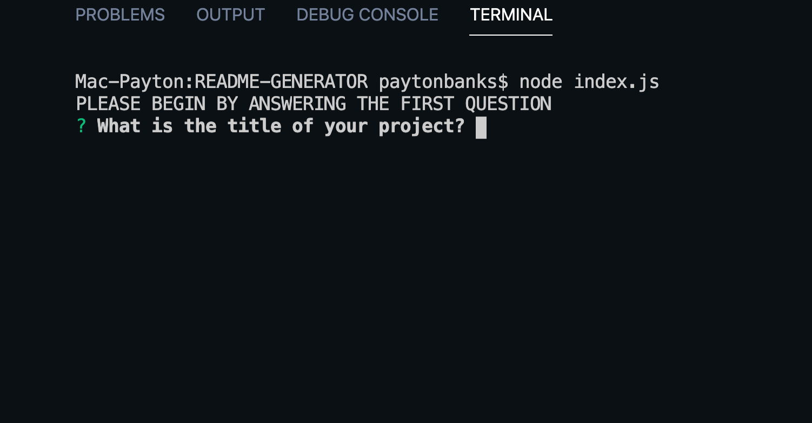
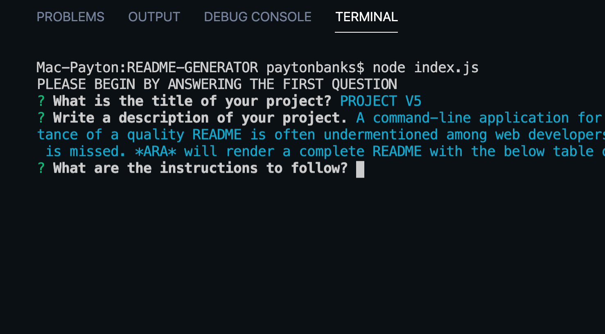
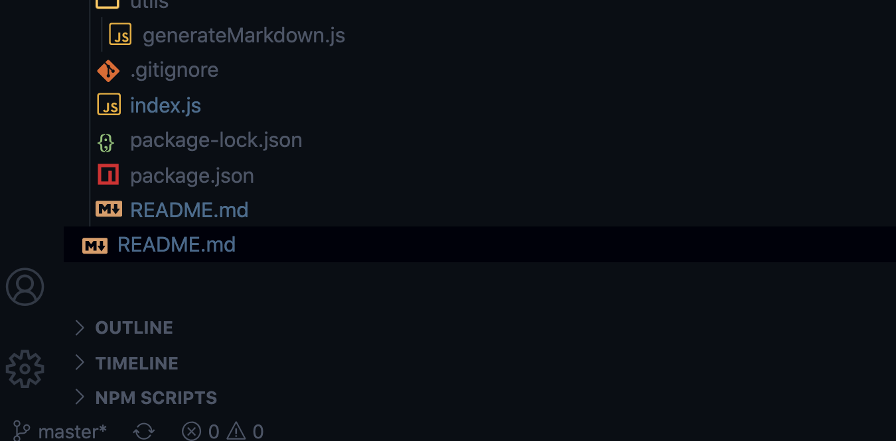

# AUTOMATIC README APPLICATION
----
>>>>>                GENERATE README FILES FROM THE COMMAND LINE >>>>>>>>>>>>> |
<br>


## Table of Contents
* [Description](#description)
* [Usage](#usage)
* [Installation](#installation)
* [License](#license)
* [Author](#questions)
* [Questions](#questions)

## Description
A command-line application for the quick and easy generation of a project README. The importance of a quality README is often undermentioned among web developers and the opportunity to provide application specific content is missed. *ARA* will render a complete README with the below table of contents. 


<br>
 
<br>


## Usage
*PROGRAM START* 
<br>
>      
<br>

## Installation
 [VS Code Code](https://code.visualstudio.com/download) <br>
 [Node.js](https://nodejs.org/en/download) <br>
 [npm/cli](https://github.com/npm/cli/releases/tag/v6.14.8)
<br>
    
### Instructions:
1. From the project's root directory, open a intergraged terminal and run: [npm init](https://docs.npmjs.com/cli/init) next a package.json file will be created in the project folder.
 
2. Within the package.json file, confirm that the *inquier desendencies* were installed, if not run: [npminstall inquirer](https://www.npmjs.com/package/inquirer) in the same root directory as the init.

3. Once inquirer is installed run the final command: [npm install](https://www.npmjs.com/package/npm-install). If there are not notifications of known "errors" the the installation is not complete until the terminal command line has returned to the root folder. 
<br>
#### PROGRAMMING: *Core Functions*  


```javascript
    Writing to Files ________________________
    function test() {
    console.log("Message to Usser");
    }

    Document Automation _______________________
    const response = generateMarkdown(input);

```
<br>

## License 
MIT License
## Author
Payton Banks
## Questions:

> [GitHub](https://github.com/${data.questions}) <br>
>[Email](mailto:payton.banks@gmail.com?subject=Questions%20about%20README%20Generator&body=I%20have%20questions%20about%20your%20README%20App%20Generator?)

<br>

*If you have any additional questions, please send them to:* Payton Banks <br> [ payton.banks@gmail.com](mailto:payton.banks@gmail.com?subject=Questions%20about%20README%20Generator&body=I%20have%20questions%20about%20your%20README%20App%20Generator?)


