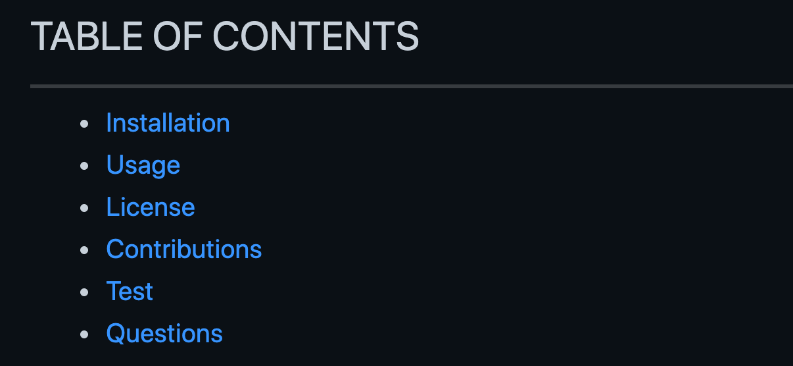

# README AUTOMATION
----
>>>> ### AUTOMATIC README APPLICATION
----

## DESCRIPTION
A command-line application for the quick and easy generation of a project README. The importance of a quality README is often undermentioned among web developers and the opportunity to provide application specific content is missed. *ARA* will render a complete README with the below table of contents. 

* Application Purpose
* Operational Instructions 
* Installation  
* Developer Contact 
* Contributions
<br>
___   

*Screen Shots* 
<br>
  

      


## PROGRAMMING 
*Core Functions* 

```javascript

Writing to Files ________________________
function test() {
 console.log("look ma’, no spaces");
}

Document Automation _______________________
const response = generateMarkdown(input);
```

## Installation
${data.installation}

## Usage
${data.usage}

## Contributors
${data.contributors}

## Testing
${data.testing}

## License 
This project is licensed under the ${data.license}. <br>


## Questions:
Payton Banks
> [GitHub](https://github.com/${data.questions}) <br>
>[Email](mailto:payton.banks@gmail.com?subject=Questions%20about%20README%20Generator&body=I%20have%20questions%20about%20your%20README%20App%20Generator?)

<br>

*If you have any additional questions, please send them to:* Payton Banks <br> [ payton.banks@gmail.com](mailto:payton.banks@gmail.com?subject=Questions%20about%20README%20Generator&body=I%20have%20questions%20about%20your%20README%20App%20Generator?)


