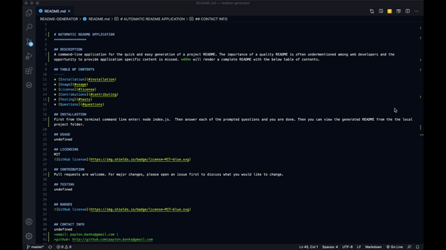

# AUTOMATIC README APPLICATION
----
>>>>>>>          <<< README AUTOMATION >>>
 

## Table of Contents
* [Description](#description)
* [Usage](#usage)
* [Installation](#installation)
* [Instructions](#instructions)
* [License](#license)
* [Author](#questions)
* [Questions](#questions)

## Description
A command-line application for the quick and easy generation of a project README. The importance of a quality README is often undermentioned among web developers and the opportunity to provide application specific content is missed. *ARA* will render a complete README with the below table of contents. 
 

## Usage

### *Easy to Begin*

 

### *Easy to Finsh*

 

[*Full Video*](https://drive.google.com/file/d/1oUyVv3ToBvc9qYHKCgWUjnRa3g5sbExL/view)

## Installation
 [VS Code Code](https://code.visualstudio.com/download)  
 [Node.js](https://nodejs.org/en/download)  
 [npm/cli](https://github.com/npm/cli/releases/tag/v6.14.8)
 

    
#### Installation Instructions:
1. From the project's root directory, open a intergraged terminal and run: [npm init](https://docs.npmjs.com/cli/init) next a package.json file will be created in the project folder.
 
2. Within the package.json file, confirm that the *inquier desendencies* were installed, if not run: [npminstall inquirer](https://www.npmjs.com/package/inquirer) in the same root directory as the init.

3. Once inquirer is installed run the final command: [npm install](https://www.npmjs.com/package/npm-install). If there are not notifications of known "errors" the the installation is not complete until the terminal command line has returned to the root folder. 
 

## Instructions
1. From the terminal command line:
node index.js
2. Answer each of the promted questions.
3. Retreve generated README from the the local project folder.

## License 
MIT License

## Author
Payton Banks

## Questions:

> [GitHub](https://github.com/${data.questions})  
>[Email](mailto:payton.banks@gmail.com?subject=Questions%20about%20README%20Generator&body=I%20have%20questions%20about%20your%20README%20App%20Generator?)

 

*If you have any additional questions, please send them to:* Payton Banks   [ payton.banks@gmail.com](mailto:payton.banks@gmail.com?subject=Questions%20about%20README%20Generator&body=I%20have%20questions%20about%20your%20README%20App%20Generator?)

